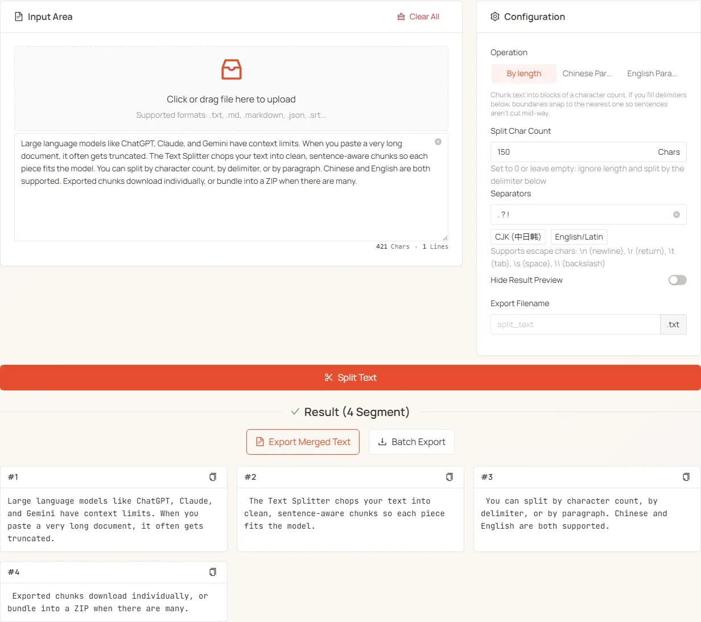

<h1 align="center">
✂️ Text Splitter
</h1>

    English | <a href="./README-zh.md">中文</a>

    <em>Powerful long text processing tool for AI model optimization, document editing, and content management</em>

  
  

**Text Splitter** is a powerful long text processing tool designed for scenarios like ChatGPT, DeepSeek, Claude and other AI model optimization, document editing, and social media content management. It offers **three splitting modes** — By Length, Chinese Paragraph, and English Paragraph — selected via a Segmented control, along with delimiter-aware boundaries, escape character support, batch export, and ZIP packaging for efficient text processing. Everything runs entirely in your browser — no servers, no uploads.

👉 **Try it online**: <https://tools.newzone.top/en/text-splitter>

## Key Features

- **Three Splitting Modes**: By Length, Chinese Paragraph, and English Paragraph, switched with a Segmented control that only shows the active mode's settings
- **Delimiter-Aware Boundaries**: An always-visible delimiter field (no toggle) snaps length-based cuts to sentence boundaries so text isn't cut mid-sentence
- **Quick Delimiter Presets**: One-click "CJK" (`。 ？ ！`) and "Latin" (`. ? !`) buttons
- **Escape Character Support**: `\n` (newline), `\r` (carriage return), `\t` (tab), `\s` (space), `\\` (backslash)
- **Batch Export**: ≤ 3 segments download individually; > 3 are automatically packaged as a ZIP
- **Merged Export**: Combine all segments into one file separated by double newlines
- **Quick Copy**: One-click copy of any segment, with a checkmark confirmation
- **Performance Friendly**: Preview auto-hides above 500 segments to keep the page responsive (export still works)
- **Fully Local**: Runs entirely in your browser, so even million-character files stay private

## How to Use

1. Paste or upload your long text (drag in a text file).
2. Pick a **mode**:
   - Fixed-size chunks (for AI input) → **By Length**
   - Long Chinese text by paragraph → **Chinese Paragraph**
   - English text by sentence → **English Paragraph**
3. To align cuts to delimiters (`. ? !` etc.), fill in the delimiter field.
4. Click **Process** — segments download as individual files (≤ 3) or a ZIP bundle (> 3).

## Three Splitting Modes

Modes are picked via the Segmented control at the top of the Configuration card. Each mode shows only its own settings, so the panel stays focused.

### 1. By Length

Chunks text into blocks of a given character count (default: 2000 — a reasonable size for LLM context windows). The **delimiter** input is **always visible**, and whether it activates is purely determined by whether the field has a value — no extra toggle needed:

- **Length > 0 + delimiter filled**: chunk by length, snapping boundaries to the nearest delimiter so sentences aren't cut mid-way
- **Length > 0 + delimiter empty**: hard chunk by length, ignoring sentence boundaries
- **Length = 0 (or empty) + delimiter filled**: ignore length entirely — split at every delimiter occurrence (delimiter is required)
- **Length = 0 + delimiter empty**: invalid — at least one must be set

The delimiter input accepts:

- Manual entry, e.g. `。 ？ ！` (separate multiple delimiters with a space)
- Click **CJK** to fill `。 ？ ！`
- Click **Latin** to fill `. ? !`
- Escape sequences: `\n`, `\r`, `\t`, `\s`, `\\`

Delimiter splits keep the delimiter at the end of each segment.

### 2. Chinese Paragraph

Detects Chinese paragraph boundaries using punctuation and line-break rules; paragraph interiors are preserved. Designed for Chinese articles, blog posts, and other content where paragraph integrity matters.

### 3. English Paragraph

Uses an English sentence algorithm (compromise NLP library) to detect paragraph boundaries. Good for documents, emails, and papers.

## Shared Settings

All modes share these:

- **Hide Results**: when there are many segments (auto-triggers above 500), enable this to hide the preview and keep the page responsive. Export still works regardless of visibility.
- **Export Filename**: base name for exported files. Defaults to the uploaded file's name, or `split_text` if nothing was uploaded. A `.txt` suffix is added unless you type another.

## Export and Copy Functions

- **Export Merged Text**: combine all segments into a single file, separated by double newlines.
- **Batch Export**: ≤ 3 segments download individually; > 3 are bundled into a single `<filename>_split_files.zip` automatically.
- **Per-Segment Copy**: each segment card has a copy button; the icon flips to a checkmark on success.

## Common Patterns

- **LLM Context Prep**: length 2000–4000 with delimiters `。 ？ ！` or `. ? !` — boundaries auto-snap to sentence ends
- **Sentence-Level Split**: length 0 + delimiters `。 ？ ！` (or `. ? !`) — one split at each delimiter
- **Paragraph-Level Split**: use Chinese Paragraph or English Paragraph mode
- **Code / Markdown Split**: By Length mode with delimiter `\n\n` (literal `\n` supported)

## FAQ

**What's the difference between the three splitting modes?** "By Length" chunks text into blocks of a fixed character count (default 2000) and snaps boundaries to a delimiter if one is provided. "Chinese Paragraph" / "English Paragraph" run language-aware sentence detection — Chinese uses punctuation rules, English uses the compromise NLP library. Pick whichever matches your input language.

**Why is there no length toggle for delimiter-only splitting?** Delimiter activation is implicit — purely controlled by whether the delimiter field has a value. Length > 0 + delimiter filled = chunk + snap. Length > 0 + delimiter empty = hard chunk. Length = 0 + delimiter filled = split at every delimiter (length ignored). Length = 0 + delimiter empty = error.

**When does batch export package as ZIP?** Above 3 segments. ≤ 3 segments download as individual files; > 3 are bundled into a single `<filename>_split_files.zip` to avoid spamming your downloads folder.

**Why does the preview hide automatically sometimes?** When the result exceeds 500 segments, the preview is auto-hidden to keep the page responsive. Click "Show Anyway" to render it, or just use the export buttons (which work regardless of visibility). You can also force-hide via the "Hide results" toggle in the config.

**Is anything uploaded?** No. The tool runs entirely in your browser — no servers, no uploads. Process even million-character files without bandwidth concerns.

## Documentation & Deployment

For detailed usage instructions and deployment guides, see the **[Official Documentation](https://docs.newzone.top/en/guide/text/text-splitter.html)**.

## Contributing

Contributions are welcome! Feel free to open issues and pull requests.

## License

MIT © 2025 [rockbenben](https://github.com/rockbenben). See [LICENSE](./LICENSE).
